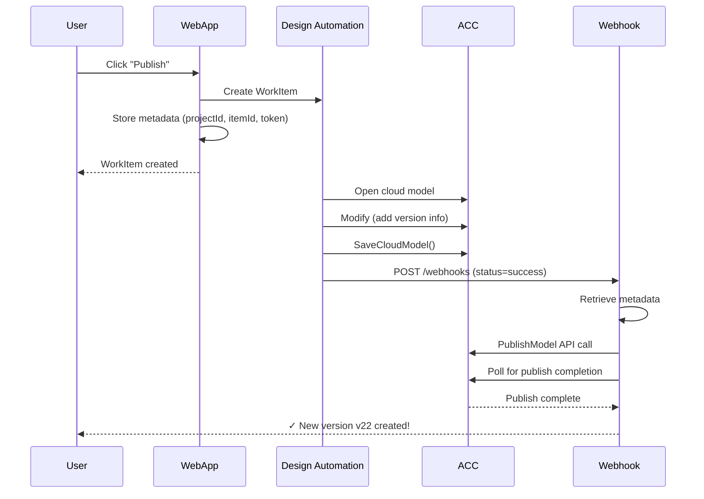

# Version Creation Fix for Revit Cloud Models

## Problem Summary

Single-user Revit Cloud Models (RCM) have an **auto-save** feature that continuously saves changes to the cloud as "unpublished changes". When using Design Automation:

- ✅ WorkItems execute successfully
- ✅ Files are opened, modified, and saved via `SaveCloudModel()`
- ❌ **BUT: No new versions are created in ACC**

### Root Cause

According to the [official Autodesk sample code](https://github.com/autodesk-platform-services/aps-revit-rcw-parameters-exchange):

> "Within the Revit plugin, Revit API can only synchronize the work-shared model with central, **no Revit API to publish the model**, you can actually publish the Revit Cloud Model by **PublishModel API in the `onComplete` callback**"

The `SaveCloudModel()` API saves changes but does NOT create versions. You must call the **PublishModel API** separately.

## Previous (Incorrect) Approach

```javascript
// ❌ WRONG: Calling PublishModel immediately after creating WorkItem
const result = await designAutomation.createWorkItem(...);
console.log(`WorkItem created: ${result.workItemId}`);

// This runs IMMEDIATELY - but WorkItem hasn't finished yet!
await axios.post('/data/v1/projects/.../commands', publishPayload);
```

**Problem**: PublishModel is called before the WorkItem finishes executing, so there are no changes to publish yet.

## New (Correct) Approach - Following Official Documentation

### 1. Create WorkItem and Store Metadata

```javascript
// routes/dataManagement.js
const result = await designAutomation.createWorkItem(...);

// Store metadata for webhook callback
const { storeWorkitemMetadata } = require('./webhooks');
storeWorkitemMetadata(result.workItemId, {
    projectId,
    itemId,
    userToken: req.accessToken,
    shouldPublish: true
});
```

### 2. Webhook Calls PublishModel After WorkItem Completes

```javascript
// routes/webhooks.js
router.post('/design-automation', async (req, res) => {
    res.status(202).send('OK'); // Respond immediately
    
    if (req.body.status === 'success') {
        const metadata = workitemMetadata.get(req.body.id);
        
        if (metadata && metadata.shouldPublish) {
            // NOW call PublishModel - file has been saved by WorkItem
            await commandApi.publishModel(
                metadata.projectId,
                publishPayload,
                {},
                oauth_client,
                metadata.userToken
            );
            
            // Poll for completion
            while (retryCount-- > 0) {
                await delay(5000);
                const status = await checkPublishStatus(...);
                if (status === 'complete') {
                    console.log('✓ New version created!');
                    break;
                }
            }
        }
    }
});
```

## Workflow Sequence



## Code Changes Made

### 1. Updated `routes/webhooks.js`

- Added `workitemMetadata` storage Map
- Added `storeWorkitemMetadata()` function  
- Enhanced webhook callback to call PublishModel when WorkItem succeeds
- Added polling to verify publish completion

### 2. Updated `routes/dataManagement.js`

- **Removed** immediate PublishModel API call (was running too early)
- **Added** metadata storage before returning response
- WorkItem now triggers file save, webhook triggers version creation

## API Commands Used

### For Single-User RCM
```javascript
{
    type: 'commands:autodesk.bim360:PublishWithoutCommentModel',
    version: '1.0.0'
}
```

### For Workshared Models
```javascript
{
    type: 'commands:autodesk.bim360:C4RModelPublish',
    version: '1.0.0'
}
```

## Testing Instructions

1. **Start the server**: Server is already running on port 3000

2. **Open the web UI**: http://localhost:3000

3. **Login with Firebase credentials**

4. **Navigate to a single-user RCM file** (e.g., architekci czerwoni.rvt)

5. **Click "Publish"**

6. **Watch the console logs**:
   ```
   ✓ WorkItem created: abc123...
   [Webhook] Stored metadata for WorkItem abc123
   
   [30 seconds later...]
   
   [Webhook] WorkItem succeeded - calling PublishModel API
   [Webhook] Calling PublishModel API...
   [Webhook] ✓ PublishModel command initiated: cmd-xyz789
   [Webhook] Publish status check 1/3: inprogress
   [Webhook] Publish status check 2/3: complete
   [Webhook] ✓✓✓ PublishModel completed successfully - new version created!
   ```

7. **Verify in ACC**: 
   - Open Autodesk Construction Cloud
   - Check file version history
   - Should see new version with current timestamp

## Expected Results

- **Before**: architekci czerwoni.rvt v21 → **After**: v22
- **Before**: architekci niebiescy.rvt v14 → **After**: v15

## Official Documentation References

1. **Revit Cloud Model Integration**:
   https://aps.autodesk.com/en/docs/design-automation/v3/developers_guide/revit_specific/revit-cloud-model-integration/

2. **Official Sample Code** (RCW Parameters Exchange):
   https://github.com/autodesk-platform-services/aps-revit-rcw-parameters-exchange
   
3. **PublishModel API Reference**:
   https://aps.autodesk.com/en/docs/data/v2/reference/http/projects-project_id-commands-POST/

## Key Points from Official Documentation

✅ Use 3-legged OAuth token as `adsk3LeggedToken` WorkItem argument  
✅ Pass `region`, `projectGuid`, `modelGuid` as input parameters  
✅ `SaveCloudModel()` saves changes but does NOT create versions  
✅ **Call PublishModel API in the webhook callback** after WorkItem completes  
✅ Poll publish status to verify completion

## Troubleshooting

### If Webhook Doesn't Fire
- Check `WEBHOOK_URL` environment variable points to your server
- If using ngrok: `http://abc123.ngrok.io/webhooks/design-automation`
- If local: `http://your-public-ip:3000/webhooks/design-automation`

### If PublishModel Fails
- Check console logs for specific error message
- Verify user has permission to publish files in ACC
- Verify 3-legged token has `data:write` scope
- Check that itemId is valid and file exists

### If Version Not Created
- Check ACC file properties - may need to refresh
- Wait 30-60 seconds for ACC to process the publish
- Check webhook logs for publish completion status

## Next Steps

1. Test with both RCM files (czerwoni and niebiescy)
2. Verify version increment in ACC
3. Test with different users/credentials
4. Add error handling for edge cases
5. Consider adding email notifications when versions are created
